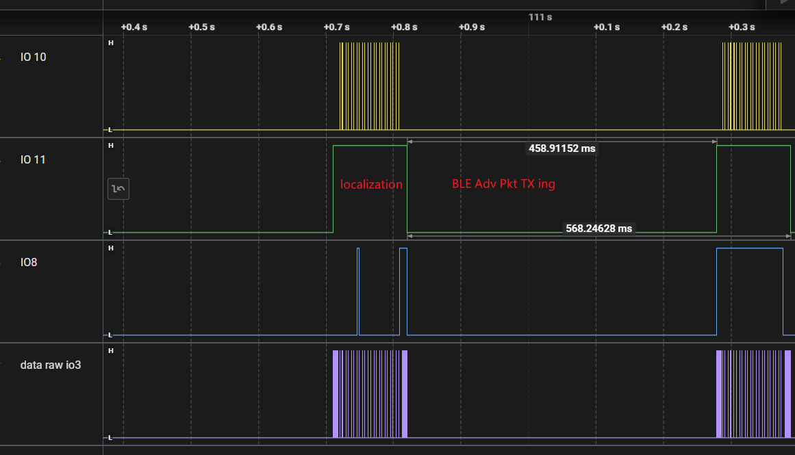

# Simultaneous Localization and Clock Calibration

To use this code correctly, please note the following steps:

1. If using `3WB boot loading` and connecting `BTSRC_SEL-VDDD`, after the code download is complete, be sure to disconnect the `BTSRC_SEL-VDDD` jumper cap. Pulling up `BTSRC_SEL` will disable the optical receiver (refer to: `SCuM_3C_User_Guide.pdf`, 7.2 3-Wire Bus Bootloading, P18.)

## Period Latency Check

The code in this branch reduces the main loop cycle (positioning + BLE packet transmission) to as low as 568ms by removing all serial print outputs and unnecessary delay loops. Specifically, the positioning phase takes approximately 110ms, during which lighthouse signals are collected and the position is calculated. Afterward, the system switches states to generate and transmit the Bluetooth packets. Transmitting the packets refers to the time required to sweep through 32 fine parameters under the already determined LC coarse/mid parameters, which takes approximately 458ms.

